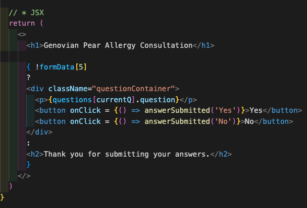
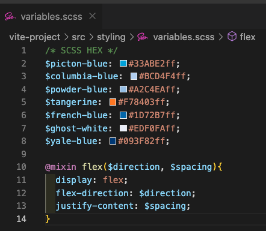
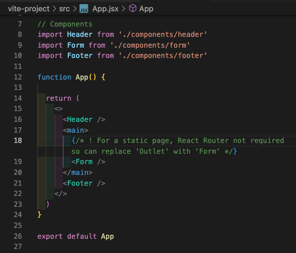

# ReadMe - Genovia (HeliosX FrontEnd Take Home Exercise) #

** **

## The Task

Your task specifically relates to the "Consultation" phase of the user journey. We would like you to: 

* Create a web page that asks 5 yes/no questions of the customer, gathering data that will later be reviewed by a doctor. 
* The customer should answer each question individually before the next question is revealed.
* Upon the customer completing the last question:
    * Display a simple 'thank you' message to the customer.
    * Pass the collected data to a service/util class function that in a real situation would send the data to our API. For this task however, the function should simply console.log the data (or similar).
* You are required to use ReactJS for the exercise, but are free to use JavaScript or TypeScript, along with any other libraries you wish to include.
* The page should:
    * Be usable at both mobile and desktop screen resolutions.
    * Include a header containing one of our brand logos.
    * Include a footer that has two columns at desktop resolution.
* Please include a README containing any notes that you would like us to read, along with any instructions needed to run the application locally. E.g. any notes on trade offs you made, required NodeJS versions, etc.

## Getting Started/Code Installation

[GitHub Repo](https://github.com/philiphart1006/genovia) >> npm install >> npm run dev

(N.B. I am running Node v18.18.2)

## Wins

#### One question at a time

In order to display just one question at a time until the current question is answered, I considered a number of options:

Firstly, list out all 5 questions individually within the JSX and hide/show questions using class names that would change an element from display: none to showing.

However, not only was this code not DRY - having to write out a lot of repeat code - it would also require identifying the next question div element in order to change the class name.

Ultimately, I made the questions an object variable that could be iterated through so that I only needed to write out the question element once within the JSX.

## Challenges

#### Input type

While I would have preferred radio buttons over buttons, I found it more straightforward to pass the answer’s value through to the state’s `formData` when users simply clicked buttons.

## Key Learnings/Takeaways

#### Folder hierarchy/installed packages

##### Styling

Given the remit didn’t call for a “beautiful” customer experience. I still chose to style using SASS instead of just CSS; in particular to take advantage of:

* Variables: I was able to extract some base colours from MedExpress’s website so that this site looked on brand
* Mixins: while the two-columned footer was the only call for flex, having a flex mixin would ultimately save me from additional lines of coding as more styling was required for the page

##### Components

While this page was only static, I still broke the app out into components and arranged these JSX files within src >> components.

## Future Improvements

* The main enhancements I thought would be useful would be:
    * A confirmation step at the end before answers are submitted that showed a customer’s selections
    * The ability to go back
    * A level of completion indicator so the customer knew how far through the form they were